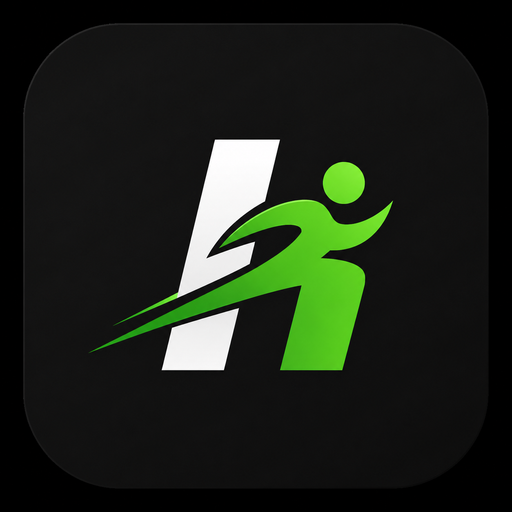
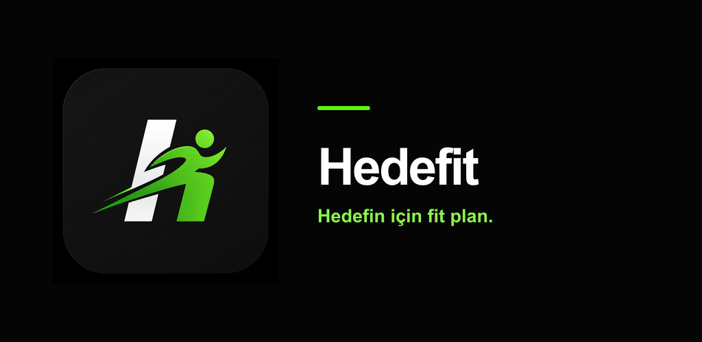

# Hedefit

### Hedefin için fit plan.

Planını sen yazma. Hedefit profilini, ekipmanını ve her antrenmandan sonra
verdiğin geri bildirimi okuyup programını kendisi ayarlar.

**Türkçe** · [English](#hedefit--your-ai-trainer-that-adapts-to-you)

---

## Nedir?

Çoğu fitness uygulaması sana sabit bir program verir ve gerisini sana bırakır.
Hedefit tersini yapar: ilk gün seni tanır, sonra **her antrenmandan sonra
dinler**. Hareket zor geldiyse yükü düşürür, kolay geldiyse artırır, ağrı
bildirdiğin bölgeyi programdan çıkarır.

Yanında bir de beslenme tarafı var — yediğini yazman yeterli, yapay zeka
kalori ve makroları hesaplasın.

## Öne çıkanlar

### Sana özel program, tek seferlik değil
Yaşın, boyun, kilon, hedefin, nerede çalıştığın (ev/salon) ve elindeki ekipmana
göre bir plan üretilir. Sonra bu plan sabit kalmaz: her seansın ardından
sorduğu "nasıldı?" sorusunun cevabına göre set, tekrar ve dinlenme süreleri
kendiliğinden ayarlanır.

### Antrenman oynatıcı
Set ve dinlenme sayaçları, ağırlık · tekrar · zorluk kaydı. Bir önceki
performansına bakıp güvenli bir sonraki adım önerir — ağrı veya yüksek
yorgunluk bildirdiysen **yükü artırmayı reddeder**.

### 106 hareket, hepsi animasyonlu
Her hareketin nasıl yapıldığını gösteren yerel animasyon kareleri, kas grubu ve
ekipman filtreleri, Türkçe hareket ve kas adları.

### AI kalori takibi
- **Yazarak** — yemek adını ve tarttığın gramajı gir; yapay zeka porsiyonun
  kalori, protein, karbonhidrat, yağ ve lif değerlerini hesaplasın

### İlerlemeni gör
Vücut ölçümleri ve trend grafikleri, tahmini 1RM ile kişisel rekorlar, günlük
seri takibi, koşu/yürüyüş/bisiklet/yüzme gibi aktivite kayıtları ve haftalık
yapay zeka değerlendirmesi.

### AI koç sohbeti
Programın, hareketlerin veya beslenmen hakkında soru sor. Koç senin profilini
ve planını bilerek cevaplar.

### Ayrıntılar
Açık ve koyu tema · kg/lb birim tercihi · antrenman takvimi ve hatırlatıcılar ·
Türkçe ve İngilizce · tüm verilerini tek JSON dosyası olarak indirme

## Sürümler

| | Ücretsiz | Premium |
|---|---|---|
| Antrenman planı, oynatıcı, hareket kütüphanesi | ✔ | ✔ |
| Manuel öğün kaydı ve makro takibi | ✔ | ✔ |
| Ölçümler, rekorlar, seri, takvim | ✔ | ✔ |
| AI koç sohbeti | günde 5 mesaj | günde 20 mesaj |
| Yazarak AI besin tahmini | günde 3 öğün | günde 20 öğün |
| Planı AI ile yeniden düzenleme | ayda 1 | adil kullanım kapsamında |
| Haftalık AI değerlendirmesi | örnek özet | tam kişisel analiz |
| Hedef tahmini ve gelişmiş içgörüler | — | ✔ |

Premium: **₺89/ay** veya **₺799/yıl**.

Ücretsiz kullanıcı günlük AI hakkını doldurduğunda, isterse kısa bir ödüllü
reklam izleyip o gün için ekstra hak kazanabilir (bkz. Gizliliğin bölümü).

## Gizliliğin

- **Konum toplanmaz.** Uygulamada GPS izni yok.
- **Reklam yalnızca isteğe bağlı.** Ücretsiz kullanıcı, günlük AI hakkı dolduğunda isterse
  ödüllü bir reklam (Google AdMob) izleyerek ekstra hak kazanabilir; sürekli görünen banner
  veya interstitial reklam yoktur. AdMob, reklam kimliği gibi verileri Google'ın kendi
  gizlilik politikası kapsamında işler.
- **Hesabın senin.** Uygulama içinden dondurabilir, tüm verini indirebilir, ilerlemeni
  sıfırlayabilir veya hesabını kalıcı olarak silebilirsin.

Ayrıntılar: [Gizlilik Politikası](store-assets/GIZLILIK-POLITIKASI.md)

## Platformlar

Web tarayıcısı · Android · iOS

> Uygulama henüz Google Play ve App Store'da yayında değil.

## Sağlık uyarısı

Hedefit tıbbi bir cihaz değildir. Ürettiği plan, kalori hedefi ve
değerlendirmeler tıbbi teşhis, tedavi veya beslenme reçetesi yerine geçmez.
Hamilelik, emzirme, yeme bozukluğu öyküsü, diyabet, kalp veya böbrek
rahatsızlığı gibi durumlarda uygulamayı kullanmadan önce bir sağlık uzmanına
danışın. Antrenman sırasında keskin ağrı, göğüs ağrısı veya baş dönmesi
yaşarsanız durun ve hekime başvurun.

 

---

# Hedefit — your AI trainer that adapts to you

Stop writing your own program. Hedefit reads your profile, your equipment and
the feedback you give after every session, then adjusts the plan itself.

[Türkçe](#hedefit) · **English**

---

## What is it?

Most fitness apps hand you a fixed program and leave the rest to you. Hedefit
does the opposite: it gets to know you on day one, then **listens after every
workout**. Too hard, and it backs the load off. Too easy, and it pushes. Report
pain somewhere, and it routes around that area.

There's a nutrition side too — log what you eat by photographing it or entering
the food name and measured weight for an AI calorie and macro estimate.

## Highlights

### A program built for you, and rebuilt as you go
Your age, height, weight, goal, training place (home/gym) and available
equipment shape the initial plan. It doesn't stay fixed: the "how did that
feel?" question after each session drives automatic changes to sets, reps and
rest.

### Workout player
Set and rest timers, weight · reps · effort logging. It reads your last
performance to suggest a safe next step — and **refuses to raise the load** if
you reported pain or high fatigue.

### 106 exercises, all animated
Local animation frames showing how each move is performed, filters by muscle
group and equipment, exercise and muscle names in both languages.

### AI calorie tracking
- **Photo** — snap your plate, let the AI identify the meal and estimate
  portion size and macros
- **Text** — enter the food name and measured weight; AI estimates calories,
  protein, carbohydrates, fat and fiber for that portion

### Watch yourself progress
Body measurements with trend charts, personal records via estimated 1RM, daily
streaks, activity logging for running, walking, cycling and swimming, and a
weekly AI review.

### AI coach chat
Ask about your program, a specific movement, or your nutrition. The coach
answers knowing your profile and your plan.

### Details
Light and dark themes · kg/lb preference · workout calendar and reminders ·
Turkish and English · export all your data as a single JSON file

## Plans

| | Free | Premium |
|---|---|---|
| Training plan, player, exercise library | ✔ | ✔ |
| Manual meal and macro tracking | ✔ | ✔ |
| Measurements, records, streaks, calendar | ✔ | ✔ |
| AI coach chat | 5 messages/day | 20 messages/day |
| Meal photo analysis | 1 photo/day | 10 photos/day |
| AI nutrition estimate from text | 3 meals/day | 20 meals/day |
| AI plan regeneration | 1/month | fair-use access |
| Weekly AI review | sample summary | full personal analysis |
| Goal forecast and advanced insights | — | ✔ |

Premium: **₺89/month** or **₺799/year** in Türkiye.

Free users who hit their daily AI limit can optionally watch a short rewarded
ad for one extra use that day (see Your privacy below).

## Your privacy

- **Meal photos aren't stored.** Only the result (name, grams, macros) is saved.
- **No location collected.** The app requests no GPS permission.
- **Ads are opt-in only.** When a free user hits their daily AI limit, they can choose to
  watch a rewarded ad (Google AdMob) for extra usage; there are no always-on banner or
  interstitial ads. AdMob processes data like the advertising ID under Google's own
  privacy policy.
- **The account is yours.** Freeze it, export everything, reset your progress, or
  delete it permanently — all from inside the app.

Details: [Privacy Policy](store-assets/GIZLILIK-POLITIKASI.md) (Turkish)

## Platforms

Web browser · Android · iOS

> Not yet published on Google Play or the App Store.

## Health notice

Hedefit is not a medical device. The plans, calorie targets and reviews it
produces are not a substitute for medical diagnosis, treatment or a prescribed
diet. If you are pregnant or breastfeeding, have a history of eating disorders,
or live with diabetes, heart or kidney conditions, consult a health
professional before using it. Stop and seek medical help if you experience
sharp pain, chest pain or dizziness while training.

 

---

**Geliştirici misin?** Kurulum, mimari ve dağıtım için → [docs/GELISTIRME.md](docs/GELISTIRME.md) 
**Building on this?** Setup, architecture and deployment → [docs/GELISTIRME.md](docs/GELISTIRME.md)

Hareket verisi <a href="https://github.com/yuhonas/free-exercise-db">free-exercise-db</a> (Unlicense) kaynağından türetilmiştir.

